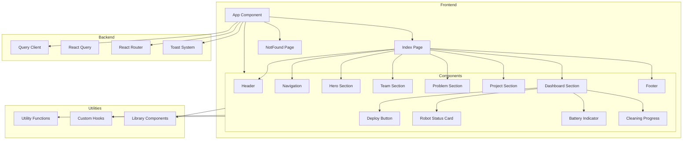

    

    <b>Automatic Architecture Diagrams from Code</b> 
    <a href="https://github.com/swark-io/swark">GitHub</a> • <a href="https://swark.io">Website</a> • <a href="mailto:contact@swark.io">Contact Us</a>

## Usage Instructions

1. **Render the Diagram**: Use the links below to open it in Mermaid Live Editor, or install the [Mermaid Support](https://marketplace.visualstudio.com/items?itemName=bierner.markdown-mermaid) extension.
2. **Recommended Model**: If available for you, use `claude-3.5-sonnet` [language model](vscode://settings/swark.languageModel). It can process more files and generates better diagrams.
3. **Iterate for Best Results**: Language models are non-deterministic. Generate the diagram multiple times and choose the best result.

## Generated Content
**Model**: GPT-4o - [Change Model](vscode://settings/swark.languageModel)  
**Mermaid Live Editor**: [View](https://mermaid.live/view#pako:eNp1lM9uozAQh1_F8rl9gRxW2qSKutKq6jbZk8nBgSnxFjzIHq82qvru6z_gGJIcAM83PwyOP_LJa2yAr3ilWyOHE9s_VZox646p3BrUBLoJkLHvwyD8wTbYD6hB0yHxH7qBfyKe2atsYcQvSFt0uhHToGzmR-TJbGow9gyyASPS5TDRF_lXtZIUanEZHi73GNxBHdthzMYiB_Yg-ykQxleBV4PHDnJmLG_F_nhUxEJ5FXuS9nREaZopmMFVdItIfrnpcpkAhg7Pa0cUbo4FS1WOvOERaUeSnN34iUWsWQIskJxcS_Jzn_0OqVoSGjEClkmObjqQWunWL6w1YK2YAJvIGB2tiJeZM2tZf2Rlfjn_mE2n_P6KOGapGCd5A1lT5CIOU35qogs_TGqkYuzsUVoS8cx2Z0vQH26_y29SnSIFo1uhtCLBM9s6HXdiWtEz4odfr7OEfSrGxk91FP4wMrx-1nX-yPBdPD5-S99CCSb5SzZ3Pn04gSfl5-wi-zKbjZ83CtPnjbnhV71C63lv6fK8m7wNbJlLNxce3w0tTL6bW3p8N7i0uPzxCyVLnAQrSfQrgMt2Re5VuEGjWzd4FKnS_IH3YHqpGv9v-1lxOkEPFV-xijfwLl1HFf_yITc0kuBJSS9wz1dkHDxw6Qh3Z11PtUHXnvjqXXYWvv4D2zD5Kw) | [Edit](https://mermaid.live/edit#pako:eNp1lM9uozAQh1_F8rl9gRxW2qSKutKq6jbZk8nBgSnxFjzIHq82qvru6z_gGJIcAM83PwyOP_LJa2yAr3ilWyOHE9s_VZox646p3BrUBLoJkLHvwyD8wTbYD6hB0yHxH7qBfyKe2atsYcQvSFt0uhHToGzmR-TJbGow9gyyASPS5TDRF_lXtZIUanEZHi73GNxBHdthzMYiB_Yg-ykQxleBV4PHDnJmLG_F_nhUxEJ5FXuS9nREaZopmMFVdItIfrnpcpkAhg7Pa0cUbo4FS1WOvOERaUeSnN34iUWsWQIskJxcS_Jzn_0OqVoSGjEClkmObjqQWunWL6w1YK2YAJvIGB2tiJeZM2tZf2Rlfjn_mE2n_P6KOGapGCd5A1lT5CIOU35qogs_TGqkYuzsUVoS8cx2Z0vQH26_y29SnSIFo1uhtCLBM9s6HXdiWtEz4odfr7OEfSrGxk91FP4wMrx-1nX-yPBdPD5-S99CCSb5SzZ3Pn04gSfl5-wi-zKbjZ83CtPnjbnhV71C63lv6fK8m7wNbJlLNxce3w0tTL6bW3p8N7i0uPzxCyVLnAQrSfQrgMt2Re5VuEGjWzd4FKnS_IH3YHqpGv9v-1lxOkEPFV-xijfwLl1HFf_yITc0kuBJSS9wz1dkHDxw6Qh3Z11PtUHXnvjqXXYWvv4D2zD5Kw)

